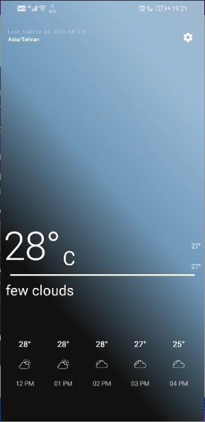
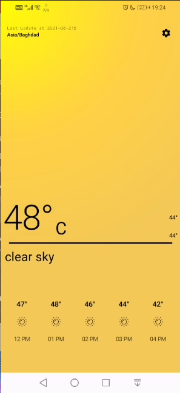
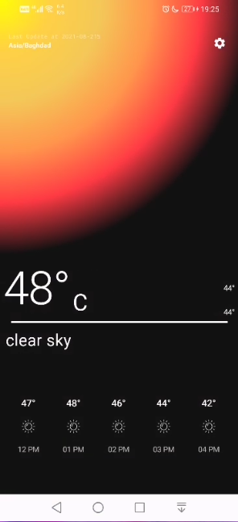

# InstaWeather

> Jetpack compose weather application

## Screenshots

Cloudy | Clear Sky day | Clear Sky night
------ | ------------- | ---------------
 |  | 

##Development:

### Provide API key

Get your API key from [OpenWeatherMap](https://openweathermap.org) and get your API key! Put your API key inside `WEATHER_API_KEY` in 'local.properties'.
Hit build!

**Pull requests are welcome!**